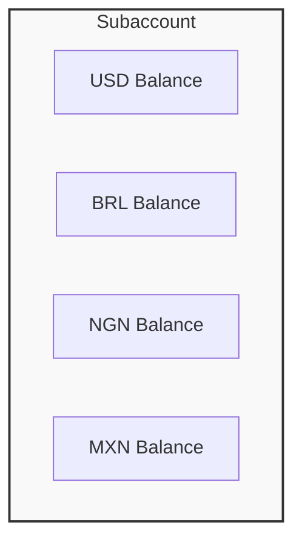
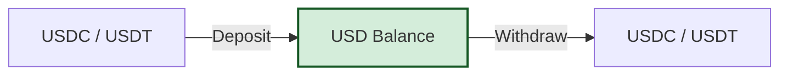

## Overview

Bullring's multi-currency architecture allows each subaccount to hold balances in all supported fiat currencies simultaneously. This design enables seamless operations across different regions without needing multiple accounts.

- **Unified Subaccount**: A single subaccount manages accounts for USD, BRL, NGN, MXN, and other supported currencies.
- **Stablecoin Parity**: USD balances maintain a 1:1 parity with stablecoins (USDC, USDT), bridging the gap between fiat and crypto.
- **Internal Conversion**: Convert funds between currencies internally without initiating external blockchain or bank transactions.

For a full list of available currencies, see [Supported Currencies](/en/supported-currencies).

## How Multi-currency Balances Work

### Independent Currency Balances

Each currency balance within a subaccount is isolated and tracked separately. There is no automatic conversion between currencies; balances update independently based on your specific deposit, withdrawal, and conversion actions.

### USD and Stablecoin Equivalence

The USD balance in a Bullring subaccount operates with a 1:1 relationship to stablecoins. This feature allows for the seamless movement of funds between crypto rails and traditional fiat systems.

- **Deposits**: When you deposit USDC or USDT, your USD balance increases 1:1.
- **Withdrawals**: When you withdraw funds as stablecoins, your USD balance decreases 1:1.

This equivalence provides crypto-native users the ability to interact with fiat systems (like local bank payouts) without requiring a traditional bank account in the US.

### KYC Requirements

<Warning>
  **Important**: Users must complete the appropriate KYC/KYB level for each currency they intend to use.
</Warning>

Different currencies and regions have distinct regulatory requirements. A subaccount verified for USD operations may need additional verification to transact in BRL or NGN.

- **Verification Scope**: Verification is often per-region or per-currency family.
- **Compliance**: Attempting to transact in a currency without the proper KYC status will result in an API error.

For details on how to verify subaccounts, refer to the [Onboarding](/en/use-cases/onboarding) guide.

## How to Use Multi-currency Balances

### Capabilities

- **View Balances**: Retrieve the current balance for all currencies associated with a subaccount in a single request.
- **Convert Currencies**: Exchange funds between supported currencies (e.g., USD to BRL) internally at current market rates. These conversions are **atomic** and **instant**, occurring entirely within the Bullring ledger.

### Relevant Resources

Integrate these capabilities into your application using the following API endpoints:

- **View Balances**: [Get Subaccount Balance](/api-reference/balances/get-balance)
- **Convert Currencies**: [Convert Currency](/api-reference/conversions/convert-currency)
- **Get Conversion Quote**: [Get Conversion Quote](/api-reference/conversions/get-conversion-quote)
- **Check Rates**: [Pre-Transaction Estimates](/en/use-cases/rates-estimates)

## Related Topics

- [Supported Currencies](/en/supported-currencies) - Full list of available currencies and networks.
- [Accounts & Subaccounts](/en/accounts) - Understanding the account structure.
- [Deposits & On-Ramping](/en/use-cases/fiat-on-ramp) - Funding your account.
- [Beneficiaries & Payouts](/en/use-cases/beneficiaries) - Withdrawing funds to external accounts.

