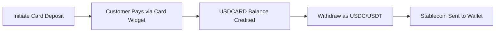

## Overview

Card Collection enables you to accept USD payments from customers using debit or credit cards. When a card deposit is initiated, the API returns a hosted **payment link** that redirects the customer to a secure card payment widget. Once the payment is completed, the funds are credited to the subaccount's `USDCARD` balance.

You can then withdraw these funds as stablecoins (USDC or USDT) to any supported blockchain network.

### Flow Summary



## 1. Initiate Card Deposit

To collect a card payment, send a `POST` request to the deposits endpoint with the USD card channel ID and the amount to collect.

<Card title="API Reference" icon="code" href="/api-reference/endpoint/post-v1-ramp-subaccountid-banking-deposits">
  See the full endpoint documentation
</Card>

### Request

```bash
curl -X POST "https://api.bullring.finance/v1/ramp/{subaccountId}/banking/deposits" \
  -H "Content-Type: application/json" \
  -H "x-api-key: YOUR_API_KEY" \
  -d '{
    "channelId": "usd-card-channel-id-bullring-finance",
    "amount": 50,
    "redirectUrl": "https://yourapp.com/payment/complete"
  }'
```

### Response

```json
{
  "status": "processing",
  "amount": 50,
  "currency": "USD",
  "country": "US",
  "channelId": "usd-card-channel-id-bullring-finance",
  "id": "9b33f86e-f832-477c-bb26-71a9e0e73f18",
  "paymentLink": "https://merchant.vesicash.com/checkout/PY_7c81d7bde52b44908518e9acf"
}
```

**Key Response Fields:**
- `paymentLink` -- Redirect your customer to this URL. It opens a hosted card payment widget where the customer enters their card details and completes the payment.
- `id` -- Unique identifier for this deposit. Use it to track status via webhooks.
- `status` -- Initial status is `processing` while awaiting card payment.

### Handling the Payment Link

After receiving the response, redirect or present the `paymentLink` to your customer:

1. **Web integration:** Redirect the browser to `paymentLink`, or open it in a new tab / iframe.
2. **Mobile integration:** Open `paymentLink` in an in-app browser or WebView.
3. Once the customer completes payment on the widget, they are redirected back and the deposit is confirmed.

## Mobile Integration

For mobile apps, you can present the card payment widget inside a WebView. The pattern is the same across platforms: initiate the deposit via your backend, receive the `paymentLink`, and load it in a WebView. When the customer completes payment and is redirected to your `redirectUrl`, detect the navigation change and close the WebView.

### Key Integration Code

<CodeGroup>
```javascript React Native (Expo)
import { WebView } from 'react-native-webview';
import { Modal, SafeAreaView, View, TouchableOpacity, Text, ActivityIndicator } from 'react-native';

// After initiating the deposit via your backend, you receive a paymentLink.
// Present it in a WebView modal:

const COMPLETION_URL = 'https://yourapp.com/payment/complete'; // Must match your redirectUrl

function CardPaymentModal({ paymentUrl, visible, onClose, onPaymentComplete }) {
  const handleNavigationChange = (navState) => {
    // Detect when the widget redirects to your completion URL
    if (navState.url.startsWith(COMPLETION_URL)) {
      onPaymentComplete();
      onClose();
    }
  };

  return (
    <Modal visible={visible} animationType="slide" onRequestClose={onClose}>
      <SafeAreaView style={{ flex: 1, backgroundColor: '#fff' }}>
        <View style={{ flexDirection: 'row', alignItems: 'center', justifyContent: 'space-between', padding: 12, backgroundColor: '#f5f5f5' }}>
          <TouchableOpacity onPress={onClose}>
            <Text style={{ fontSize: 13, color: '#555' }}>Cancel</Text>
          </TouchableOpacity>
          <Text style={{ fontSize: 12, color: '#888' }}>Secure Payment</Text>
          <View style={{ width: 50 }} />
        </View>

        <WebView
          source={{ uri: paymentUrl }}
          onNavigationStateChange={handleNavigationChange}
          javaScriptEnabled
          domStorageEnabled
          startInLoadingState
          renderLoading={() => (
            <View style={{ position: 'absolute', inset: 0, alignItems: 'center', justifyContent: 'center' }}>
              <ActivityIndicator size="large" />
            </View>
          )}
        />
      </SafeAreaView>
    </Modal>
  );
}
```
```swift Swift (iOS)
import SwiftUI
import WebKit

struct CardPaymentView: UIViewRepresentable {
    let paymentUrl: URL
    let completionUrl: String // Must match your redirectUrl
    let onPaymentComplete: () -> Void

    func makeCoordinator() -> Coordinator {
        Coordinator(completionUrl: completionUrl, onPaymentComplete: onPaymentComplete)
    }

    func makeUIView(context: Context) -> WKWebView {
        let webView = WKWebView()
        webView.navigationDelegate = context.coordinator
        webView.load(URLRequest(url: paymentUrl))
        return webView
    }

    func updateUIView(_ uiView: WKWebView, context: Context) {}

    class Coordinator: NSObject, WKNavigationDelegate {
        let completionUrl: String
        let onPaymentComplete: () -> Void

        init(completionUrl: String, onPaymentComplete: @escaping () -> Void) {
            self.completionUrl = completionUrl
            self.onPaymentComplete = onPaymentComplete
        }

        func webView(_ webView: WKWebView,
                      decidePolicyFor navigationAction: WKNavigationAction,
                      decisionHandler: @escaping (WKNavigationActionPolicy) -> Void) {
            // Detect when the widget redirects to your completion URL
            if let url = navigationAction.request.url,
               url.absoluteString.hasPrefix(completionUrl) {
                onPaymentComplete()
                decisionHandler(.cancel)
                return
            }
            decisionHandler(.allow)
        }
    }
}

// Usage: present as a sheet
struct PaymentSheet: View {
    let paymentUrl: URL
    @Environment(\.dismiss) var dismiss

    var body: some View {
        NavigationStack {
            CardPaymentView(
                paymentUrl: paymentUrl,
                completionUrl: "https://yourapp.com/payment/complete",
                onPaymentComplete: { dismiss() }
            )
            .navigationTitle("Secure Payment")
            .navigationBarTitleDisplayMode(.inline)
            .toolbar {
                ToolbarItem(placement: .cancellationAction) {
                    Button("Cancel") { dismiss() }
                }
            }
        }
    }
}
```
```kotlin Android (Kotlin)
import android.annotation.SuppressLint
import android.os.Bundle
import android.webkit.WebResourceRequest
import android.webkit.WebView
import android.webkit.WebViewClient
import androidx.appcompat.app.AppCompatActivity

class CardPaymentActivity : AppCompatActivity() {

    companion object {
        const val EXTRA_PAYMENT_URL = "payment_url"
        // Must match your redirectUrl
        private const val COMPLETION_URL = "https://yourapp.com/payment/complete"
    }

    @SuppressLint("SetJavaScriptEnabled")
    override fun onCreate(savedInstanceState: Bundle?) {
        super.onCreate(savedInstanceState)

        val paymentUrl = intent.getStringExtra(EXTRA_PAYMENT_URL)
            ?: return finish()

        val webView = WebView(this).apply {
            settings.javaScriptEnabled = true
            settings.domStorageEnabled = true

            webViewClient = object : WebViewClient() {
                override fun shouldOverrideUrlLoading(
                    view: WebView?,
                    request: WebResourceRequest?
                ): Boolean {
                    val url = request?.url?.toString() ?: return false
                    // Detect when the widget redirects to your completion URL
                    if (url.startsWith(COMPLETION_URL)) {
                        setResult(RESULT_OK)
                        finish()
                        return true
                    }
                    return false
                }
            }

            loadUrl(paymentUrl)
        }

        setContentView(webView)
    }
}

// Launch from your Activity or Fragment:
// val intent = Intent(this, CardPaymentActivity::class.java)
//     .putExtra(CardPaymentActivity.EXTRA_PAYMENT_URL, paymentLink)
// startActivityForResult(intent, REQUEST_CARD_PAYMENT)
```
</CodeGroup>

### How It Works

1. Your app calls the Bullring API to initiate a card deposit and receives the `paymentLink`.
2. Open the `paymentLink` in a WebView -- as a modal (React Native), sheet (SwiftUI), or new Activity (Android).
3. The customer completes payment on the hosted widget.
4. The widget redirects to your `redirectUrl` -- detect this in the WebView's navigation delegate/client and dismiss the view.
5. Listen for the `deposit.status.paid` webhook to confirm the payment.

<Card title="Try the React Native example" icon="mobile" href="https://snack.expo.dev/@johnaniserebullring/bullring-finance-card-collection?platform=ios">
  Open the interactive Expo Snack to see the complete mobile integration in action
</Card>

## 2. Listen for Webhook Events

Track the status of the card deposit in real-time using webhooks:

- `deposit.status.paid` -- The card payment has been successfully completed and the `USDCARD` balance has been credited.
- `deposit.status.unpaid` -- The card payment failed or was declined.

See [Deposit Events](/en/deposit-events) for full webhook payload details.

## 3. Withdraw from Card Collection Balance

Once funds are credited to the `USDCARD` balance, you can withdraw them as stablecoins (USDC or USDT) to an external wallet address. Use the `balance_account` field set to `USDCARD` to specify the source balance.

<Card title="API Reference" icon="code" href="/api-reference/endpoint/post-v1-ramp-subaccountid-banking-withdrawals-stablecoin">
  See the full endpoint documentation
</Card>

### Request

```bash
curl -X POST "https://api.bullring.finance/v1/ramp/{subaccountId}/banking/withdrawals/stablecoin" \
  -H "Content-Type: application/json" \
  -H "x-api-key: YOUR_API_KEY" \
  -d '{
    "amount": "2",
    "stablecoin": "usdc",
    "chain": "celo",
    "balance_account": "USDCARD",
    "address": "0x1f774D2e96806D5d95be371Da80F462Dd05f3f6A"
  }'
```

**Request Fields:**
- `amount` -- The amount in USD to withdraw.
- `stablecoin` -- The stablecoin to receive: `usdc` or `usdt`.
- `chain` -- The blockchain network: `ethereum`, `polygon`, `solana`, `celo`, or `tron`.
- `balance_account` -- Set to `USDCARD` to withdraw from the card collection balance.
- `address` -- The destination wallet address on the specified chain.

### Response

```json
{
  "id": "0cc9a924-3185-4e44-b282-a4849cefb73e",
  "amount": "2",
  "currency": "USD",
  "status": "pending",
  "created_at": "2026-03-18T21:12:16.521Z",
  "protocol": "usdc_trf",
  "fee_amount": "0",
  "fee_currency": "USD",
  "chain": "celo",
  "destination_address": "0x***6A",
  "local_amount": "2",
  "local_currency": "USD",
  "net_amount": "2.00000000",
  "rate": "1"
}
```

**Key Response Fields:**
- `id` -- Unique withdrawal identifier.
- `status` -- The withdrawal status (`pending`, then `completed` or `failed`).
- `destination_address` -- Masked version of the destination wallet address.
- `net_amount` -- The amount that will be sent after fees.
- `fee_amount` / `fee_currency` -- Transaction fees applied.

## 4. Track Withdrawal Status

Monitor the withdrawal via webhooks:

- `withdrawal.status.completed` -- The stablecoin transfer has been confirmed on-chain.
- `withdrawal.status.failed` -- The withdrawal could not be processed.

See [Withdrawal Events](/en/withdrawal-events) for full webhook payload details.

## Complete Integration Example

Here is the complete card collection flow from deposit to stablecoin withdrawal:

<CodeGroup>
```bash 1. Initiate Card Deposit
curl -X POST "https://api.bullring.finance/v1/ramp/{subaccountId}/banking/deposits" \
  -H "Content-Type: application/json" \
  -H "x-api-key: YOUR_API_KEY" \
  -d '{
    "channelId": "usd-card-channel-id-bullring-finance",
    "amount": 50,
    "redirectUrl": "https://yourapp.com/payment/complete"
  }'
```
```bash 2. Withdraw as USDC (after deposit confirmed)
curl -X POST "https://api.bullring.finance/v1/ramp/{subaccountId}/banking/withdrawals/stablecoin" \
  -H "Content-Type: application/json" \
  -H "x-api-key: YOUR_API_KEY" \
  -d '{
    "amount": "50",
    "stablecoin": "usdc",
    "chain": "celo",
    "balance_account": "USDCARD",
    "address": "0x1f774D2e96806D5d95be371Da80F462Dd05f3f6A"
  }'
```
</CodeGroup>

## Common Mistakes

- **Not redirecting to payment link:** The `paymentLink` must be presented to the customer. The deposit will not complete until the customer pays through the card widget.
- **Wrong balance account:** When withdrawing card collection funds, you must set `balance_account` to `USDCARD`. Omitting this field will attempt to withdraw from the standard USD balance.
- **Insufficient USDCARD balance:** Ensure the card deposit has been confirmed (via webhook) before initiating a withdrawal from the `USDCARD` balance.
- **Mismatched chain and address:** Always verify the destination wallet address matches the specified blockchain network. Sending to the wrong network will result in permanent loss of funds.
