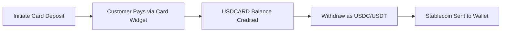

## Overview

Card Collection enables you to accept USD payments from customers using debit or credit cards. When a card deposit is initiated, the API returns a hosted **payment link** that redirects the customer to a secure card payment widget. Once the payment is completed, the funds are credited to the subaccount's `USDCARD` balance.

You can then withdraw these funds as stablecoins (USDC or USDT) to any supported blockchain network.

### Flow Summary



## 1. Initiate Card Deposit

To collect a card payment, send a `POST` request to the deposits endpoint with the USD card channel ID and the amount to collect.

<Card title="API Reference" icon="code" href="/api-reference/endpoint/post-v1-ramp-subaccountid-banking-deposits">
  See the full endpoint documentation
</Card>

### Request

```bash
curl -X POST "https://api.bullring.finance/v1/ramp/{subaccountId}/banking/deposits" \
  -H "Content-Type: application/json" \
  -H "x-api-key: YOUR_API_KEY" \
  -d '{
    "channelId": "usd-card-channel-id-bullring-finance",
    "amount": 50
  }'
```

### Response

```json
{
  "status": "processing",
  "amount": 50,
  "currency": "USD",
  "country": "US",
  "channelId": "usd-card-channel-id-bullring-finance",
  "id": "9b33f86e-f832-477c-bb26-71a9e0e73f18",
  "paymentLink": "https://merchant.vesicash.com/checkout/PY_7c81d7bde52b44908518e9acf"
}
```

**Key Response Fields:**
- `paymentLink` -- Redirect your customer to this URL. It opens a hosted card payment widget where the customer enters their card details and completes the payment.
- `id` -- Unique identifier for this deposit. Use it to track status via webhooks.
- `status` -- Initial status is `processing` while awaiting card payment.

### Handling the Payment Link

After receiving the response, redirect or present the `paymentLink` to your customer:

1. **Web integration:** Redirect the browser to `paymentLink`, or open it in a new tab / iframe.
2. **Mobile integration:** Open `paymentLink` in an in-app browser or WebView.
3. Once the customer completes payment on the widget, they are redirected back and the deposit is confirmed.

## 2. Listen for Webhook Events

Track the status of the card deposit in real-time using webhooks:

- `deposit.status.paid` -- The card payment has been successfully completed and the `USDCARD` balance has been credited.
- `deposit.status.unpaid` -- The card payment failed or was declined.

See [Deposit Events](/en/deposit-events) for full webhook payload details.

## 3. Withdraw from Card Collection Balance

Once funds are credited to the `USDCARD` balance, you can withdraw them as stablecoins (USDC or USDT) to an external wallet address. Use the `balance_account` field set to `USDCARD` to specify the source balance.

<Card title="API Reference" icon="code" href="/api-reference/endpoint/post-v1-ramp-subaccountid-banking-withdrawals-stablecoin">
  See the full endpoint documentation
</Card>

### Request

```bash
curl -X POST "https://api.bullring.finance/v1/ramp/{subaccountId}/banking/withdrawals/stablecoin" \
  -H "Content-Type: application/json" \
  -H "x-api-key: YOUR_API_KEY" \
  -d '{
    "amount": "2",
    "stablecoin": "usdc",
    "chain": "celo",
    "balance_account": "USDCARD",
    "address": "0x1f774D2e96806D5d95be371Da80F462Dd05f3f6A"
  }'
```

**Request Fields:**
- `amount` -- The amount in USD to withdraw.
- `stablecoin` -- The stablecoin to receive: `usdc` or `usdt`.
- `chain` -- The blockchain network: `ethereum`, `polygon`, `solana`, `celo`, or `tron`.
- `balance_account` -- Set to `USDCARD` to withdraw from the card collection balance.
- `address` -- The destination wallet address on the specified chain.

### Response

```json
{
  "id": "0cc9a924-3185-4e44-b282-a4849cefb73e",
  "amount": "2",
  "currency": "USD",
  "status": "pending",
  "created_at": "2026-03-18T21:12:16.521Z",
  "protocol": "usdc_trf",
  "fee_amount": "0",
  "fee_currency": "USD",
  "chain": "celo",
  "destination_address": "0x***6A",
  "local_amount": "2",
  "local_currency": "USD",
  "net_amount": "2.00000000",
  "rate": "1"
}
```

**Key Response Fields:**
- `id` -- Unique withdrawal identifier.
- `status` -- The withdrawal status (`pending`, then `completed` or `failed`).
- `destination_address` -- Masked version of the destination wallet address.
- `net_amount` -- The amount that will be sent after fees.
- `fee_amount` / `fee_currency` -- Transaction fees applied.

## 4. Track Withdrawal Status

Monitor the withdrawal via webhooks:

- `withdrawal.status.completed` -- The stablecoin transfer has been confirmed on-chain.
- `withdrawal.status.failed` -- The withdrawal could not be processed.

See [Withdrawal Events](/en/withdrawal-events) for full webhook payload details.

## Complete Integration Example

Here is the complete card collection flow from deposit to stablecoin withdrawal:

<CodeGroup>
```bash 1. Initiate Card Deposit
curl -X POST "https://api.bullring.finance/v1/ramp/{subaccountId}/banking/deposits" \
  -H "Content-Type: application/json" \
  -H "x-api-key: YOUR_API_KEY" \
  -d '{
    "channelId": "usd-card-channel-id-bullring-finance",
    "amount": 50
  }'
```
```bash 2. Withdraw as USDC (after deposit confirmed)
curl -X POST "https://api.bullring.finance/v1/ramp/{subaccountId}/banking/withdrawals/stablecoin" \
  -H "Content-Type: application/json" \
  -H "x-api-key: YOUR_API_KEY" \
  -d '{
    "amount": "50",
    "stablecoin": "usdc",
    "chain": "celo",
    "balance_account": "USDCARD",
    "address": "0x1f774D2e96806D5d95be371Da80F462Dd05f3f6A"
  }'
```
</CodeGroup>

## Common Mistakes

- **Not redirecting to payment link:** The `paymentLink` must be presented to the customer. The deposit will not complete until the customer pays through the card widget.
- **Wrong balance account:** When withdrawing card collection funds, you must set `balance_account` to `USDCARD`. Omitting this field will attempt to withdraw from the standard USD balance.
- **Insufficient USDCARD balance:** Ensure the card deposit has been confirmed (via webhook) before initiating a withdrawal from the `USDCARD` balance.
- **Mismatched chain and address:** Always verify the destination wallet address matches the specified blockchain network. Sending to the wrong network will result in permanent loss of funds.
