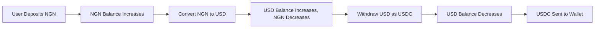

## Overview

Bullring's multi-currency architecture allows each subaccount to hold balances in all supported fiat currencies simultaneously. This design enables seamless operations across different regions without needing multiple accounts.

### KYC Requirements

<Warning>
  **Important**: Users must complete the appropriate KYC/KYB level for each currency they intend to use.
</Warning>

Different currencies and regions have distinct regulatory requirements. A subaccount verified for USD operations may need additional verification to transact in BRL or NGN. Verification is often per-region or per-currency family. Attempting to transact in a currency without the proper KYC status will result in an API error.

For details on how to verify subaccounts, refer to the [Onboarding](/en/use-cases/onboarding) guide.

## Common Use Cases

### Cross-border Business Operations
- Collect payments in local currencies (BRL, NGN, MXN)
- Maintain reserves in multiple currencies
- Convert to preferred currency when needed
- Send payouts in recipients' local currencies

### Crypto-to-Fiat Bridge
- Receive stablecoins (USDC/USDT) which are credited as USD
- Convert USD to local fiat currency
- Send fiat payouts to bank accounts
- Related: [Crypto Off-ramp](/en/use-cases/crypto-offramp)

### Currency Risk Management
- Hold multiple currency balances to hedge against volatility
- Pre-convert to target currency before exchange rate changes
- Match currency of revenue with currency of expenses

### Remittance Services
- Collect in sender's currency
- Convert at optimal rates
- Deliver in recipient's local currency
- Related: [Remittance](/en/use-cases/remittance)

## Multi-currency Workflow Example

### End-to-End Flow

### Step-by-step conceptual flow

1. **Fund the subaccount** in any supported currency via deposits.
   - Link: [Deposits & On-Ramping](/en/use-cases/fiat-on-ramp)

2. **Monitor balances** across all currencies in the subaccount.

3. **Convert currencies** internally as needed for your use case.

4. **Send payouts** in the appropriate currency.
   - Link: [Beneficiaries & Payouts](/en/use-cases/beneficiaries)
   - Link: [Collections and Payouts](/en/use-cases/collections-and-payouts)

## Related Topics

- [Supported Currencies](/en/supported-currencies) - Full list of available currencies and networks
- [Accounts & Subaccounts](/en/accounts) - Understanding account structure
- [Pre-Transaction Estimates](/en/use-cases/rates-estimates) - Getting exchange rates and fees
- [Deposits & On-Ramping](/en/use-cases/fiat-on-ramp) - Funding your account
- [Beneficiaries & Payouts](/en/use-cases/beneficiaries) - Withdrawing funds
- [Remittance](/en/use-cases/remittance) - Cross-border payment flows

