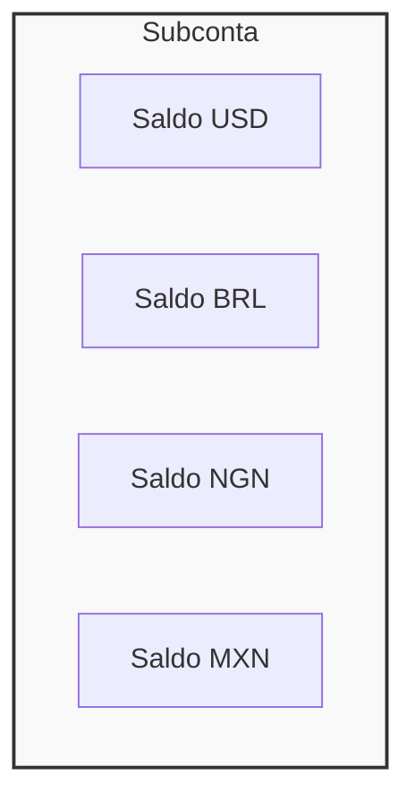
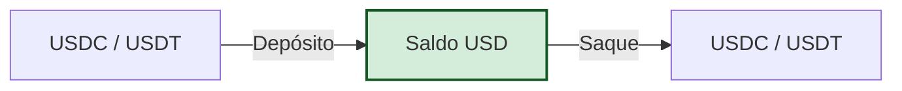

## Visão Geral

A arquitetura multi-moedas da Bullring permite que cada subconta mantenha saldos em todas as moedas fiduciárias suportadas simultaneamente. Este design possibilita operações contínuas em diferentes regiões sem a necessidade de múltiplas contas.

- **Subconta Unificada**: Uma única subconta gerencia contas para USD, BRL, NGN, MXN e outras moedas suportadas.
- **Paridade com Stablecoins**: Os saldos em USD mantêm uma paridade de 1:1 com stablecoins (USDC, USDT), conectando o sistema fiduciário ao cripto.
- **Conversão Interna**: Converta fundos entre moedas internamente sem iniciar transações externas de blockchain ou bancárias.

Para uma lista completa de moedas disponíveis, consulte [Moedas Suportadas](/pt/supported-currencies).

## Como Funcionam os Saldos Multi-moedas

### Saldos de Moedas Independentes

Cada saldo de moeda dentro de uma subconta é isolado e rastreado separadamente. Não há conversão automática entre moedas; os saldos são atualizados independentemente com base em suas ações específicas de depósito, saque e conversão.

### Equivalência entre USD e Stablecoins

O saldo em USD em uma subconta Bullring opera com uma relação de 1:1 com stablecoins. Este recurso permite a movimentação contínua de fundos entre redes cripto e sistemas fiduciários tradicionais.

- **Depósitos**: Quando você deposita USDC ou USDT, seu saldo em USD aumenta na proporção de 1:1.
- **Saques**: Quando você saca fundos como stablecoins, seu saldo em USD diminui na proporção de 1:1.

Esta equivalência proporciona aos usuários nativos de cripto a capacidade de interagir com sistemas fiduciários (como pagamentos bancários locais) sem a necessidade de uma conta bancária tradicional nos EUA.

### Requisitos de KYC

<Warning>
  **Importante**: Os usuários devem completar o nível apropriado de KYC/KYB para
  cada moeda que pretendem usar.
</Warning>

Diferentes moedas e regiões têm requisitos regulatórios distintos. Uma subconta verificada para operações em USD pode precisar de verificação adicional para transacionar em BRL ou NGN.

- **Escopo de Verificação**: A verificação é frequentemente por região ou por família de moedas.
- **Conformidade**: Tentar transacionar em uma moeda sem o status de KYC apropriado resultará em um erro de API.

Para detalhes sobre como verificar subcontas, consulte o guia de [Integração](/pt/use-cases/onboarding).

## Como Usar Saldos Multi-moedas

### Capacidades

- **Visualizar Saldos**: Recupere o saldo atual de todas as moedas associadas a uma subconta em uma única requisição.
- **Converter Moedas**: Troque fundos entre moedas suportadas (por exemplo, USD para BRL) internamente às taxas de mercado atuais. Essas conversões são **atômicas** e **instantâneas**, ocorrendo inteiramente dentro do ledger da Bullring.

### Recursos Relevantes

Integre essas capacidades em sua aplicação usando os seguintes endpoints da API:

- **Visualizar Saldos**: [Obter Saldo da Subconta](/api-reference/balances/get-balance)
- **Converter Moedas**: [Converter Moeda](/api-reference/conversions/convert-currency)
- **Obter Cotação de Conversão**: [Obter Cotação de Conversão](/api-reference/conversions/get-conversion-quote)
- **Verificar Taxas**: [Estimativas Pré-Transação](/pt/use-cases/rates-estimates)

## Tópicos Relacionados

- [Moedas Suportadas](/pt/supported-currencies) - Lista completa de moedas e redes disponíveis.
- [Contas e Subcontas](/pt/accounts) - Compreendendo a estrutura de contas.
- [Depósitos e On-Ramping](/pt/use-cases/fiat-on-ramp) - Financiando sua conta.
- [Beneficiários e Pagamentos](/pt/use-cases/beneficiaries) - Sacando fundos para contas externas.
