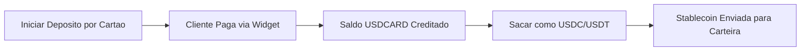

## Visao Geral

A Cobranca por Cartao permite que voce aceite pagamentos em USD de clientes usando cartoes de debito ou credito. Quando um deposito por cartao e iniciado, a API retorna um **link de pagamento** hospedado que redireciona o cliente para um widget seguro de pagamento por cartao. Apos a conclusao do pagamento, os fundos sao creditados no saldo `USDCARD` da subconta.

Voce pode entao sacar esses fundos como stablecoins (USDC ou USDT) para qualquer rede blockchain suportada.

### Resumo do Fluxo



## 1. Iniciar Deposito por Cartao

Para cobrar um pagamento por cartao, envie uma requisicao `POST` para o endpoint de depositos com o ID do canal de cartao USD e o valor a ser cobrado.

<Card title="Referencia da API" icon="code" href="/api-reference/endpoint/post-v1-ramp-subaccountid-banking-deposits">
  Veja a documentacao completa do endpoint
</Card>

### Requisicao

```bash
curl -X POST "https://api.bullring.finance/v1/ramp/{subaccountId}/banking/deposits" \
  -H "Content-Type: application/json" \
  -H "x-api-key: SUA_CHAVE_DE_API" \
  -d '{
    "channelId": "usd-card-channel-id-bullring-finance",
    "amount": 50,
    "redirectUrl": "https://yourapp.com/payment/complete"
  }'
```

### Resposta

```json
{
  "status": "processing",
  "amount": 50,
  "currency": "USD",
  "country": "US",
  "channelId": "usd-card-channel-id-bullring-finance",
  "id": "9b33f86e-f832-477c-bb26-71a9e0e73f18",
  "paymentLink": "https://merchant.vesicash.com/checkout/PY_7c81d7bde52b44908518e9acf"
}
```

**Campos Importantes da Resposta:**
- `paymentLink` -- Redirecione seu cliente para esta URL. Ela abre um widget hospedado de pagamento por cartao onde o cliente insere os dados do cartao e conclui o pagamento.
- `id` -- Identificador unico para este deposito. Use-o para rastrear o status via webhooks.
- `status` -- O status inicial e `processing` enquanto aguarda o pagamento por cartao.

### Tratamento do Link de Pagamento

Apos receber a resposta, redirecione ou apresente o `paymentLink` ao seu cliente:

1. **Integracao web:** Redirecione o navegador para o `paymentLink`, ou abra-o em uma nova aba / iframe.
2. **Integracao mobile:** Abra o `paymentLink` em um navegador in-app ou WebView.
3. Apos o cliente concluir o pagamento no widget, ele e redirecionado de volta e o deposito e confirmado.

## Integracao Mobile

Para aplicativos moveis, voce pode apresentar o widget de pagamento por cartao dentro de uma WebView. O padrao e o mesmo em todas as plataformas: inicie o deposito pelo seu backend, receba o `paymentLink` e carregue-o em uma WebView. Quando o cliente concluir o pagamento e for redirecionado para a sua `redirectUrl`, detecte a mudanca de navegacao e feche a WebView.

### Codigo Principal da Integracao

<CodeGroup>
```javascript React Native (Expo)
import { WebView } from 'react-native-webview';
import { Modal, SafeAreaView, View, TouchableOpacity, Text, ActivityIndicator } from 'react-native';

// Apos iniciar o deposito pelo seu backend, voce recebe um paymentLink.
// Apresente-o em uma WebView modal:

const COMPLETION_URL = 'https://yourapp.com/payment/complete'; // Deve corresponder ao seu redirectUrl

function CardPaymentModal({ paymentUrl, visible, onClose, onPaymentComplete }) {
  const handleNavigationChange = (navState) => {
    // Detecta quando o widget redireciona para a URL de conclusao
    if (navState.url.startsWith(COMPLETION_URL)) {
      onPaymentComplete();
      onClose();
    }
  };

  return (
    <Modal visible={visible} animationType="slide" onRequestClose={onClose}>
      <SafeAreaView style={{ flex: 1, backgroundColor: '#fff' }}>
        <View style={{ flexDirection: 'row', alignItems: 'center', justifyContent: 'space-between', padding: 12, backgroundColor: '#f5f5f5' }}>
          <TouchableOpacity onPress={onClose}>
            <Text style={{ fontSize: 13, color: '#555' }}>Cancelar</Text>
          </TouchableOpacity>
          <Text style={{ fontSize: 12, color: '#888' }}>Pagamento Seguro</Text>
          <View style={{ width: 50 }} />
        </View>

        <WebView
          source={{ uri: paymentUrl }}
          onNavigationStateChange={handleNavigationChange}
          javaScriptEnabled
          domStorageEnabled
          startInLoadingState
          renderLoading={() => (
            <View style={{ position: 'absolute', inset: 0, alignItems: 'center', justifyContent: 'center' }}>
              <ActivityIndicator size="large" />
            </View>
          )}
        />
      </SafeAreaView>
    </Modal>
  );
}
```
```swift Swift (iOS)
import SwiftUI
import WebKit

struct CardPaymentView: UIViewRepresentable {
    let paymentUrl: URL
    let completionUrl: String // Deve corresponder ao seu redirectUrl
    let onPaymentComplete: () -> Void

    func makeCoordinator() -> Coordinator {
        Coordinator(completionUrl: completionUrl, onPaymentComplete: onPaymentComplete)
    }

    func makeUIView(context: Context) -> WKWebView {
        let webView = WKWebView()
        webView.navigationDelegate = context.coordinator
        webView.load(URLRequest(url: paymentUrl))
        return webView
    }

    func updateUIView(_ uiView: WKWebView, context: Context) {}

    class Coordinator: NSObject, WKNavigationDelegate {
        let completionUrl: String
        let onPaymentComplete: () -> Void

        init(completionUrl: String, onPaymentComplete: @escaping () -> Void) {
            self.completionUrl = completionUrl
            self.onPaymentComplete = onPaymentComplete
        }

        func webView(_ webView: WKWebView,
                      decidePolicyFor navigationAction: WKNavigationAction,
                      decisionHandler: @escaping (WKNavigationActionPolicy) -> Void) {
            // Detecta quando o widget redireciona para a URL de conclusao
            if let url = navigationAction.request.url,
               url.absoluteString.hasPrefix(completionUrl) {
                onPaymentComplete()
                decisionHandler(.cancel)
                return
            }
            decisionHandler(.allow)
        }
    }
}

// Uso: apresente como uma sheet
struct PaymentSheet: View {
    let paymentUrl: URL
    @Environment(\.dismiss) var dismiss

    var body: some View {
        NavigationStack {
            CardPaymentView(
                paymentUrl: paymentUrl,
                completionUrl: "https://yourapp.com/payment/complete",
                onPaymentComplete: { dismiss() }
            )
            .navigationTitle("Pagamento Seguro")
            .navigationBarTitleDisplayMode(.inline)
            .toolbar {
                ToolbarItem(placement: .cancellationAction) {
                    Button("Cancelar") { dismiss() }
                }
            }
        }
    }
}
```
```kotlin Android (Kotlin)
import android.annotation.SuppressLint
import android.os.Bundle
import android.webkit.WebResourceRequest
import android.webkit.WebView
import android.webkit.WebViewClient
import androidx.appcompat.app.AppCompatActivity

class CardPaymentActivity : AppCompatActivity() {

    companion object {
        const val EXTRA_PAYMENT_URL = "payment_url"
        // Deve corresponder ao seu redirectUrl
        private const val COMPLETION_URL = "https://yourapp.com/payment/complete"
    }

    @SuppressLint("SetJavaScriptEnabled")
    override fun onCreate(savedInstanceState: Bundle?) {
        super.onCreate(savedInstanceState)

        val paymentUrl = intent.getStringExtra(EXTRA_PAYMENT_URL)
            ?: return finish()

        val webView = WebView(this).apply {
            settings.javaScriptEnabled = true
            settings.domStorageEnabled = true

            webViewClient = object : WebViewClient() {
                override fun shouldOverrideUrlLoading(
                    view: WebView?,
                    request: WebResourceRequest?
                ): Boolean {
                    val url = request?.url?.toString() ?: return false
                    // Detecta quando o widget redireciona para a URL de conclusao
                    if (url.startsWith(COMPLETION_URL)) {
                        setResult(RESULT_OK)
                        finish()
                        return true
                    }
                    return false
                }
            }

            loadUrl(paymentUrl)
        }

        setContentView(webView)
    }
}

// Inicie a partir da sua Activity ou Fragment:
// val intent = Intent(this, CardPaymentActivity::class.java)
//     .putExtra(CardPaymentActivity.EXTRA_PAYMENT_URL, paymentLink)
// startActivityForResult(intent, REQUEST_CARD_PAYMENT)
```
</CodeGroup>

### Como Funciona

1. Seu aplicativo chama a API da Bullring para iniciar um deposito por cartao e recebe o `paymentLink`.
2. Abra o `paymentLink` em uma WebView -- como modal (React Native), sheet (SwiftUI) ou nova Activity (Android).
3. O cliente conclui o pagamento no widget hospedado.
4. O widget redireciona para a sua `redirectUrl` -- detecte isso no delegate/client de navegacao da WebView e feche a view.
5. Escute o webhook `deposit.status.paid` para confirmar o pagamento.

<Card title="Experimente o exemplo em React Native" icon="mobile" href="https://snack.expo.dev/@johnaniserebullring/bullring-finance-card-collection?platform=ios">
  Abra o Expo Snack interativo para ver a integracao mobile completa em acao
</Card>

## 2. Escutar Eventos de Webhook

Acompanhe o status do deposito por cartao em tempo real usando webhooks:

- `deposit.status.paid` -- O pagamento por cartao foi concluido com sucesso e o saldo `USDCARD` foi creditado.
- `deposit.status.unpaid` -- O pagamento por cartao falhou ou foi recusado.

Veja [Eventos de Deposito](/pt/deposit-events) para detalhes completos do payload dos webhooks.

## 3. Sacar do Saldo de Cobranca por Cartao

Apos os fundos serem creditados no saldo `USDCARD`, voce pode saca-los como stablecoins (USDC ou USDT) para um endereco de carteira externo. Use o campo `balance_account` definido como `USDCARD` para especificar o saldo de origem.

<Card title="Referencia da API" icon="code" href="/api-reference/endpoint/post-v1-ramp-subaccountid-banking-withdrawals-stablecoin">
  Veja a documentacao completa do endpoint
</Card>

### Requisicao

```bash
curl -X POST "https://api.bullring.finance/v1/ramp/{subaccountId}/banking/withdrawals/stablecoin" \
  -H "Content-Type: application/json" \
  -H "x-api-key: SUA_CHAVE_DE_API" \
  -d '{
    "amount": "2",
    "stablecoin": "usdc",
    "chain": "celo",
    "balance_account": "USDCARD",
    "address": "0x1f774D2e96806D5d95be371Da80F462Dd05f3f6A"
  }'
```

**Campos da Requisicao:**
- `amount` -- O valor em USD a ser sacado.
- `stablecoin` -- A stablecoin a receber: `usdc` ou `usdt`.
- `chain` -- A rede blockchain: `ethereum`, `polygon`, `solana`, `celo` ou `tron`.
- `balance_account` -- Defina como `USDCARD` para sacar do saldo de cobranca por cartao.
- `address` -- O endereco da carteira de destino na rede especificada.

### Resposta

```json
{
  "id": "0cc9a924-3185-4e44-b282-a4849cefb73e",
  "amount": "2",
  "currency": "USD",
  "status": "pending",
  "created_at": "2026-03-18T21:12:16.521Z",
  "protocol": "usdc_trf",
  "fee_amount": "0",
  "fee_currency": "USD",
  "chain": "celo",
  "destination_address": "0x***6A",
  "local_amount": "2",
  "local_currency": "USD",
  "net_amount": "2.00000000",
  "rate": "1"
}
```

**Campos Importantes da Resposta:**
- `id` -- Identificador unico do saque.
- `status` -- O status do saque (`pending`, depois `completed` ou `failed`).
- `destination_address` -- Versao mascarada do endereco da carteira de destino.
- `net_amount` -- O valor que sera enviado apos as taxas.
- `fee_amount` / `fee_currency` -- Taxas da transacao aplicadas.

## 4. Rastrear Status do Saque

Monitore o saque via webhooks:

- `withdrawal.status.completed` -- A transferencia de stablecoin foi confirmada on-chain.
- `withdrawal.status.failed` -- O saque nao pode ser processado.

Veja [Eventos de Saque](/pt/withdrawal-events) para detalhes completos do payload dos webhooks.

## Exemplo Completo de Integracao

Aqui esta o fluxo completo de cobranca por cartao, do deposito ao saque em stablecoin:

<CodeGroup>
```bash 1. Iniciar Deposito por Cartao
curl -X POST "https://api.bullring.finance/v1/ramp/{subaccountId}/banking/deposits" \
  -H "Content-Type: application/json" \
  -H "x-api-key: SUA_CHAVE_DE_API" \
  -d '{
    "channelId": "usd-card-channel-id-bullring-finance",
    "amount": 50,
    "redirectUrl": "https://yourapp.com/payment/complete"
  }'
```
```bash 2. Sacar como USDC (apos deposito confirmado)
curl -X POST "https://api.bullring.finance/v1/ramp/{subaccountId}/banking/withdrawals/stablecoin" \
  -H "Content-Type: application/json" \
  -H "x-api-key: SUA_CHAVE_DE_API" \
  -d '{
    "amount": "50",
    "stablecoin": "usdc",
    "chain": "celo",
    "balance_account": "USDCARD",
    "address": "0x1f774D2e96806D5d95be371Da80F462Dd05f3f6A"
  }'
```
</CodeGroup>

## Erros Comuns

- **Nao redirecionar para o link de pagamento:** O `paymentLink` deve ser apresentado ao cliente. O deposito nao sera concluido ate que o cliente pague atraves do widget de cartao.
- **Conta de saldo errada:** Ao sacar fundos de cobranca por cartao, voce deve definir `balance_account` como `USDCARD`. Omitir este campo tentara sacar do saldo USD padrao.
- **Saldo USDCARD insuficiente:** Certifique-se de que o deposito por cartao foi confirmado (via webhook) antes de iniciar um saque do saldo `USDCARD`.
- **Rede e endereco incompativeis:** Sempre verifique se o endereco da carteira de destino corresponde a rede blockchain especificada. Enviar para a rede errada resultara em perda permanente de fundos.
