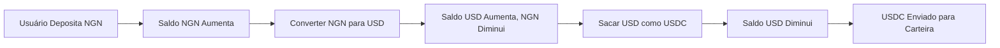

## Visão Geral

A arquitetura multi-moedas da Bullring permite que cada subconta mantenha saldos em todas as moedas fiduciárias suportadas simultaneamente. Este design possibilita operações contínuas em diferentes regiões sem a necessidade de múltiplas contas.

### Requisitos de KYC

<Warning>
  **Importante**: Os usuários devem completar o nível apropriado de KYC/KYB para
  cada moeda que pretendem usar.
</Warning>

Diferentes moedas e regiões têm requisitos regulatórios distintos. Uma subconta verificada para operações em USD pode precisar de verificação adicional para transacionar em BRL ou NGN. A verificação é frequentemente por região ou por família de moedas. Tentar transacionar em uma moeda sem o status de KYC apropriado resultará em um erro de API.

Para detalhes sobre como verificar subcontas, consulte o guia de [Integração](/pt/use-cases/onboarding).

## Casos de Uso Comuns

### Operações Comerciais Transfronteiriças

- Coletar pagamentos em moedas locais (BRL, NGN, MXN)
- Manter reservas em múltiplas moedas
- Converter para a moeda preferida quando necessário
- Enviar pagamentos nas moedas locais dos destinatários

### Ponte Cripto-para-Fiat

- Receber stablecoins (USDC/USDT) que são creditadas como USD
- Converter USD para moeda fiduciária local
- Enviar pagamentos fiduciários para contas bancárias
- Relacionado: [Crypto Off-ramp](/pt/use-cases/crypto-offramp)

### Gestão de Risco Cambial

- Manter saldos em múltiplas moedas para se proteger contra volatilidade
- Pré-converter para a moeda alvo antes de mudanças na taxa de câmbio
- Combinar a moeda da receita com a moeda das despesas

### Serviços de Remessa

- Coletar na moeda do remetente
- Converter às melhores taxas
- Entregar na moeda local do destinatário
- Relacionado: [Remessa](/pt/use-cases/remittance)

## Exemplo de Fluxo Multi-moedas

### Fluxo Ponta a Ponta

### Fluxo conceitual passo a passo

1. **Financiar a subconta** em qualquer moeda suportada via depósitos.

   - Link: [Depósitos e On-Ramping](/pt/use-cases/fiat-on-ramp)

2. **Monitorar saldos** em todas as moedas na subconta.

3. **Converter moedas** internamente conforme necessário para seu caso de uso.

4. **Enviar pagamentos** na moeda apropriada.
   - Link: [Beneficiários e Pagamentos](/pt/use-cases/beneficiaries)
   - Link: [Cobranças e Pagamentos](/pt/use-cases/collections-and-payouts)

## Tópicos Relacionados

- [Moedas Suportadas](/pt/supported-currencies) - Lista completa de moedas e redes disponíveis
- [Contas e Subcontas](/pt/accounts) - Compreendendo a estrutura de contas
- [Estimativas Pré-Transação](/pt/use-cases/rates-estimates) - Obtendo taxas de câmbio e tarifas
- [Depósitos e On-Ramping](/pt/use-cases/fiat-on-ramp) - Financiando sua conta
- [Beneficiários e Pagamentos](/pt/use-cases/beneficiaries) - Sacando fundos
- [Remessa](/pt/use-cases/remittance) - Fluxos de pagamentos transfronteiriços
