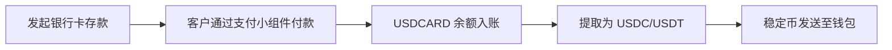

## 概述

银行卡收款功能使您能够通过借记卡或信用卡接受客户的美元付款。当发起银行卡存款时，API 会返回一个托管的**付款链接**，将客户重定向到安全的银行卡支付小组件。付款完成后，资金将记入子账户的 `USDCARD` 余额。

随后，您可以将这些资金作为稳定币（USDC 或 USDT）提取到任何支持的区块链网络。

### 流程概要



## 1. 发起银行卡存款

要收取银行卡付款，请向存款端点发送 `POST` 请求，包含美元银行卡渠道 ID 和收款金额。

<Card title="API 参考" icon="code" href="/api-reference/endpoint/post-v1-ramp-subaccountid-banking-deposits">
  查看完整的端点文档
</Card>

### 请求

```bash
curl -X POST "https://api.bullring.finance/v1/ramp/{subaccountId}/banking/deposits" \
  -H "Content-Type: application/json" \
  -H "x-api-key: YOUR_API_KEY" \
  -d '{
    "channelId": "usd-card-channel-id-bullring-finance",
    "amount": 50,
    "redirectUrl": "https://yourapp.com/payment/complete"
  }'
```

### 响应

```json
{
  "status": "processing",
  "amount": 50,
  "currency": "USD",
  "country": "US",
  "channelId": "usd-card-channel-id-bullring-finance",
  "id": "9b33f86e-f832-477c-bb26-71a9e0e73f18",
  "paymentLink": "https://merchant.vesicash.com/checkout/PY_7c81d7bde52b44908518e9acf"
}
```

**关键响应字段：**
- `paymentLink` -- 将客户重定向至此 URL。它会打开一个托管的银行卡支付小组件，客户在其中输入卡信息并完成付款。
- `id` -- 此存款的唯一标识符。用于通过 webhook 跟踪状态。
- `status` -- 等待银行卡付款时，初始状态为 `processing`。

### 处理付款链接

收到响应后，将 `paymentLink` 重定向或展示给客户：

1. **网页集成：** 将浏览器重定向到 `paymentLink`，或在新标签页 / iframe 中打开。
2. **移动端集成：** 在应用内浏览器或 WebView 中打开 `paymentLink`。
3. 客户在小组件上完成付款后，将被重定向回来，存款即确认完成。

## 2. 监听 Webhook 事件

使用 webhook 实时跟踪银行卡存款状态：

- `deposit.status.paid` -- 银行卡付款已成功完成，`USDCARD` 余额已入账。
- `deposit.status.unpaid` -- 银行卡付款失败或被拒绝。

详细的 webhook 载荷请参见[存款事件](/zh/deposit-events)。

## 3. 从银行卡收款余额提取

资金记入 `USDCARD` 余额后，您可以将其作为稳定币（USDC 或 USDT）提取到外部钱包地址。使用 `balance_account` 字段设置为 `USDCARD` 来指定来源余额。

<Card title="API 参考" icon="code" href="/api-reference/endpoint/post-v1-ramp-subaccountid-banking-withdrawals-stablecoin">
  查看完整的端点文档
</Card>

### 请求

```bash
curl -X POST "https://api.bullring.finance/v1/ramp/{subaccountId}/banking/withdrawals/stablecoin" \
  -H "Content-Type: application/json" \
  -H "x-api-key: YOUR_API_KEY" \
  -d '{
    "amount": "2",
    "stablecoin": "usdc",
    "chain": "celo",
    "balance_account": "USDCARD",
    "address": "0x1f774D2e96806D5d95be371Da80F462Dd05f3f6A"
  }'
```

**请求字段：**
- `amount` -- 要提取的美元金额。
- `stablecoin` -- 要接收的稳定币：`usdc` 或 `usdt`。
- `chain` -- 区块链网络：`ethereum`、`polygon`、`solana`、`celo` 或 `tron`。
- `balance_account` -- 设置为 `USDCARD` 以从银行卡收款余额提取。
- `address` -- 指定链上的目标钱包地址。

### 响应

```json
{
  "id": "0cc9a924-3185-4e44-b282-a4849cefb73e",
  "amount": "2",
  "currency": "USD",
  "status": "pending",
  "created_at": "2026-03-18T21:12:16.521Z",
  "protocol": "usdc_trf",
  "fee_amount": "0",
  "fee_currency": "USD",
  "chain": "celo",
  "destination_address": "0x***6A",
  "local_amount": "2",
  "local_currency": "USD",
  "net_amount": "2.00000000",
  "rate": "1"
}
```

**关键响应字段：**
- `id` -- 提款唯一标识符。
- `status` -- 提款状态（`pending`，然后变为 `completed` 或 `failed`）。
- `destination_address` -- 目标钱包地址的掩码版本。
- `net_amount` -- 扣除手续费后将发送的金额。
- `fee_amount` / `fee_currency` -- 适用的交易手续费。

## 4. 跟踪提款状态

通过 webhook 监控提款：

- `withdrawal.status.completed` -- 稳定币转账已在链上确认。
- `withdrawal.status.failed` -- 提款无法处理。

详细的 webhook 载荷请参见[提款事件](/zh/withdrawal-events)。

## 完整集成示例

以下是从存款到稳定币提取的完整银行卡收款流程：

<CodeGroup>
```bash 1. 发起银行卡存款
curl -X POST "https://api.bullring.finance/v1/ramp/{subaccountId}/banking/deposits" \
  -H "Content-Type: application/json" \
  -H "x-api-key: YOUR_API_KEY" \
  -d '{
    "channelId": "usd-card-channel-id-bullring-finance",
    "amount": 50,
    "redirectUrl": "https://yourapp.com/payment/complete"
  }'
```
```bash 2. 提取为 USDC（存款确认后）
curl -X POST "https://api.bullring.finance/v1/ramp/{subaccountId}/banking/withdrawals/stablecoin" \
  -H "Content-Type: application/json" \
  -H "x-api-key: YOUR_API_KEY" \
  -d '{
    "amount": "50",
    "stablecoin": "usdc",
    "chain": "celo",
    "balance_account": "USDCARD",
    "address": "0x1f774D2e96806D5d95be371Da80F462Dd05f3f6A"
  }'
```
</CodeGroup>

## 常见错误

- **未重定向到付款链接：** `paymentLink` 必须展示给客户。在客户通过银行卡小组件付款之前，存款不会完成。
- **错误的余额账户：** 提取银行卡收款资金时，必须将 `balance_account` 设置为 `USDCARD`。省略此字段将尝试从标准美元余额提取。
- **USDCARD 余额不足：** 确保银行卡存款已确认（通过 webhook）后再从 `USDCARD` 余额发起提款。
- **链与地址不匹配：** 始终验证目标钱包地址与指定的区块链网络匹配。发送到错误的网络将导致资金永久丢失。
