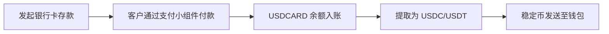

## 概述

银行卡收款功能使您能够通过借记卡或信用卡接受客户的美元付款。当发起银行卡存款时，API 会返回一个托管的**付款链接**，将客户重定向到安全的银行卡支付小组件。付款完成后，资金将记入子账户的 `USDCARD` 余额。

随后，您可以将这些资金作为稳定币（USDC 或 USDT）提取到任何支持的区块链网络。

### 流程概要



## 1. 发起银行卡存款

要收取银行卡付款，请向存款端点发送 `POST` 请求，包含美元银行卡渠道 ID 和收款金额。

<Card title="API 参考" icon="code" href="/api-reference/endpoint/post-v1-ramp-subaccountid-banking-deposits">
  查看完整的端点文档
</Card>

### 请求

```bash
curl -X POST "https://api.bullring.finance/v1/ramp/{subaccountId}/banking/deposits" \
  -H "Content-Type: application/json" \
  -H "x-api-key: YOUR_API_KEY" \
  -d '{
    "channelId": "usd-card-channel-id-bullring-finance",
    "amount": 50,
    "redirectUrl": "https://yourapp.com/payment/complete"
  }'
```

### 响应

```json
{
  "status": "processing",
  "amount": 50,
  "currency": "USD",
  "country": "US",
  "channelId": "usd-card-channel-id-bullring-finance",
  "id": "9b33f86e-f832-477c-bb26-71a9e0e73f18",
  "paymentLink": "https://merchant.vesicash.com/checkout/PY_7c81d7bde52b44908518e9acf"
}
```

**关键响应字段：**
- `paymentLink` -- 将客户重定向至此 URL。它会打开一个托管的银行卡支付小组件，客户在其中输入卡信息并完成付款。
- `id` -- 此存款的唯一标识符。用于通过 webhook 跟踪状态。
- `status` -- 等待银行卡付款时，初始状态为 `processing`。

### 处理付款链接

收到响应后，将 `paymentLink` 重定向或展示给客户：

1. **网页集成：** 将浏览器重定向到 `paymentLink`，或在新标签页 / iframe 中打开。
2. **移动端集成：** 在应用内浏览器或 WebView 中打开 `paymentLink`。
3. 客户在小组件上完成付款后，将被重定向回来，存款即确认完成。

## 移动端集成

对于移动应用，您可以在 WebView 中展示银行卡支付小组件。各平台的模式相同：通过后端发起存款，获取 `paymentLink`，然后在 WebView 中加载它。当客户完成付款并被重定向到您的 `redirectUrl` 时，检测导航变化并关闭 WebView。

### 核心集成代码

<CodeGroup>
```javascript React Native (Expo)
import { WebView } from 'react-native-webview';
import { Modal, SafeAreaView, View, TouchableOpacity, Text, ActivityIndicator } from 'react-native';

// 通过后端发起存款后，您会收到一个 paymentLink。
// 在模态 WebView 中展示它：

const COMPLETION_URL = 'https://yourapp.com/payment/complete'; // 必须与您的 redirectUrl 匹配

function CardPaymentModal({ paymentUrl, visible, onClose, onPaymentComplete }) {
  const handleNavigationChange = (navState) => {
    // 检测小组件何时重定向到完成 URL
    if (navState.url.startsWith(COMPLETION_URL)) {
      onPaymentComplete();
      onClose();
    }
  };

  return (
    <Modal visible={visible} animationType="slide" onRequestClose={onClose}>
      <SafeAreaView style={{ flex: 1, backgroundColor: '#fff' }}>
        <View style={{ flexDirection: 'row', alignItems: 'center', justifyContent: 'space-between', padding: 12, backgroundColor: '#f5f5f5' }}>
          <TouchableOpacity onPress={onClose}>
            <Text style={{ fontSize: 13, color: '#555' }}>取消</Text>
          </TouchableOpacity>
          <Text style={{ fontSize: 12, color: '#888' }}>安全支付</Text>
          <View style={{ width: 50 }} />
        </View>

        <WebView
          source={{ uri: paymentUrl }}
          onNavigationStateChange={handleNavigationChange}
          javaScriptEnabled
          domStorageEnabled
          startInLoadingState
          renderLoading={() => (
            <View style={{ position: 'absolute', inset: 0, alignItems: 'center', justifyContent: 'center' }}>
              <ActivityIndicator size="large" />
            </View>
          )}
        />
      </SafeAreaView>
    </Modal>
  );
}
```
```swift Swift (iOS)
import SwiftUI
import WebKit

struct CardPaymentView: UIViewRepresentable {
    let paymentUrl: URL
    let completionUrl: String // 必须与您的 redirectUrl 匹配
    let onPaymentComplete: () -> Void

    func makeCoordinator() -> Coordinator {
        Coordinator(completionUrl: completionUrl, onPaymentComplete: onPaymentComplete)
    }

    func makeUIView(context: Context) -> WKWebView {
        let webView = WKWebView()
        webView.navigationDelegate = context.coordinator
        webView.load(URLRequest(url: paymentUrl))
        return webView
    }

    func updateUIView(_ uiView: WKWebView, context: Context) {}

    class Coordinator: NSObject, WKNavigationDelegate {
        let completionUrl: String
        let onPaymentComplete: () -> Void

        init(completionUrl: String, onPaymentComplete: @escaping () -> Void) {
            self.completionUrl = completionUrl
            self.onPaymentComplete = onPaymentComplete
        }

        func webView(_ webView: WKWebView,
                      decidePolicyFor navigationAction: WKNavigationAction,
                      decisionHandler: @escaping (WKNavigationActionPolicy) -> Void) {
            // 检测小组件何时重定向到完成 URL
            if let url = navigationAction.request.url,
               url.absoluteString.hasPrefix(completionUrl) {
                onPaymentComplete()
                decisionHandler(.cancel)
                return
            }
            decisionHandler(.allow)
        }
    }
}

// 用法：以 sheet 形式展示
struct PaymentSheet: View {
    let paymentUrl: URL
    @Environment(\.dismiss) var dismiss

    var body: some View {
        NavigationStack {
            CardPaymentView(
                paymentUrl: paymentUrl,
                completionUrl: "https://yourapp.com/payment/complete",
                onPaymentComplete: { dismiss() }
            )
            .navigationTitle("安全支付")
            .navigationBarTitleDisplayMode(.inline)
            .toolbar {
                ToolbarItem(placement: .cancellationAction) {
                    Button("取消") { dismiss() }
                }
            }
        }
    }
}
```
```kotlin Android (Kotlin)
import android.annotation.SuppressLint
import android.os.Bundle
import android.webkit.WebResourceRequest
import android.webkit.WebView
import android.webkit.WebViewClient
import androidx.appcompat.app.AppCompatActivity

class CardPaymentActivity : AppCompatActivity() {

    companion object {
        const val EXTRA_PAYMENT_URL = "payment_url"
        // 必须与您的 redirectUrl 匹配
        private const val COMPLETION_URL = "https://yourapp.com/payment/complete"
    }

    @SuppressLint("SetJavaScriptEnabled")
    override fun onCreate(savedInstanceState: Bundle?) {
        super.onCreate(savedInstanceState)

        val paymentUrl = intent.getStringExtra(EXTRA_PAYMENT_URL)
            ?: return finish()

        val webView = WebView(this).apply {
            settings.javaScriptEnabled = true
            settings.domStorageEnabled = true

            webViewClient = object : WebViewClient() {
                override fun shouldOverrideUrlLoading(
                    view: WebView?,
                    request: WebResourceRequest?
                ): Boolean {
                    val url = request?.url?.toString() ?: return false
                    // 检测小组件何时重定向到完成 URL
                    if (url.startsWith(COMPLETION_URL)) {
                        setResult(RESULT_OK)
                        finish()
                        return true
                    }
                    return false
                }
            }

            loadUrl(paymentUrl)
        }

        setContentView(webView)
    }
}

// 从您的 Activity 或 Fragment 启动：
// val intent = Intent(this, CardPaymentActivity::class.java)
//     .putExtra(CardPaymentActivity.EXTRA_PAYMENT_URL, paymentLink)
// startActivityForResult(intent, REQUEST_CARD_PAYMENT)
```
</CodeGroup>

### 工作原理

1. 您的应用调用 Bullring API 发起银行卡存款并获取 `paymentLink`。
2. 在 WebView 中打开 `paymentLink` -- 作为模态框（React Native）、sheet（SwiftUI）或新 Activity（Android）。
3. 客户在托管小组件上完成付款。
4. 小组件重定向到您的 `redirectUrl` -- 在 WebView 的导航代理/客户端中检测并关闭视图。
5. 监听 `deposit.status.paid` webhook 以确认付款。

<Card title="试用 React Native 示例" icon="mobile" href="https://snack.expo.dev/@johnaniserebullring/bullring-finance-card-collection?platform=ios">
  打开交互式 Expo Snack 查看完整的移动端集成实例
</Card>

## 2. 监听 Webhook 事件

使用 webhook 实时跟踪银行卡存款状态：

- `deposit.status.paid` -- 银行卡付款已成功完成，`USDCARD` 余额已入账。
- `deposit.status.unpaid` -- 银行卡付款失败或被拒绝。

详细的 webhook 载荷请参见[存款事件](/zh/deposit-events)。

## 3. 从银行卡收款余额提取

资金记入 `USDCARD` 余额后，您可以将其作为稳定币（USDC 或 USDT）提取到外部钱包地址。使用 `balance_account` 字段设置为 `USDCARD` 来指定来源余额。

<Card title="API 参考" icon="code" href="/api-reference/endpoint/post-v1-ramp-subaccountid-banking-withdrawals-stablecoin">
  查看完整的端点文档
</Card>

### 请求

```bash
curl -X POST "https://api.bullring.finance/v1/ramp/{subaccountId}/banking/withdrawals/stablecoin" \
  -H "Content-Type: application/json" \
  -H "x-api-key: YOUR_API_KEY" \
  -d '{
    "amount": "2",
    "stablecoin": "usdc",
    "chain": "celo",
    "balance_account": "USDCARD",
    "address": "0x1f774D2e96806D5d95be371Da80F462Dd05f3f6A"
  }'
```

**请求字段：**
- `amount` -- 要提取的美元金额。
- `stablecoin` -- 要接收的稳定币：`usdc` 或 `usdt`。
- `chain` -- 区块链网络：`ethereum`、`polygon`、`solana`、`celo` 或 `tron`。
- `balance_account` -- 设置为 `USDCARD` 以从银行卡收款余额提取。
- `address` -- 指定链上的目标钱包地址。

### 响应

```json
{
  "id": "0cc9a924-3185-4e44-b282-a4849cefb73e",
  "amount": "2",
  "currency": "USD",
  "status": "pending",
  "created_at": "2026-03-18T21:12:16.521Z",
  "protocol": "usdc_trf",
  "fee_amount": "0",
  "fee_currency": "USD",
  "chain": "celo",
  "destination_address": "0x***6A",
  "local_amount": "2",
  "local_currency": "USD",
  "net_amount": "2.00000000",
  "rate": "1"
}
```

**关键响应字段：**
- `id` -- 提款唯一标识符。
- `status` -- 提款状态（`pending`，然后变为 `completed` 或 `failed`）。
- `destination_address` -- 目标钱包地址的掩码版本。
- `net_amount` -- 扣除手续费后将发送的金额。
- `fee_amount` / `fee_currency` -- 适用的交易手续费。

## 4. 跟踪提款状态

通过 webhook 监控提款：

- `withdrawal.status.completed` -- 稳定币转账已在链上确认。
- `withdrawal.status.failed` -- 提款无法处理。

详细的 webhook 载荷请参见[提款事件](/zh/withdrawal-events)。

## 完整集成示例

以下是从存款到稳定币提取的完整银行卡收款流程：

<CodeGroup>
```bash 1. 发起银行卡存款
curl -X POST "https://api.bullring.finance/v1/ramp/{subaccountId}/banking/deposits" \
  -H "Content-Type: application/json" \
  -H "x-api-key: YOUR_API_KEY" \
  -d '{
    "channelId": "usd-card-channel-id-bullring-finance",
    "amount": 50,
    "redirectUrl": "https://yourapp.com/payment/complete"
  }'
```
```bash 2. 提取为 USDC（存款确认后）
curl -X POST "https://api.bullring.finance/v1/ramp/{subaccountId}/banking/withdrawals/stablecoin" \
  -H "Content-Type: application/json" \
  -H "x-api-key: YOUR_API_KEY" \
  -d '{
    "amount": "50",
    "stablecoin": "usdc",
    "chain": "celo",
    "balance_account": "USDCARD",
    "address": "0x1f774D2e96806D5d95be371Da80F462Dd05f3f6A"
  }'
```
</CodeGroup>

## 常见错误

- **未重定向到付款链接：** `paymentLink` 必须展示给客户。在客户通过银行卡小组件付款之前，存款不会完成。
- **错误的余额账户：** 提取银行卡收款资金时，必须将 `balance_account` 设置为 `USDCARD`。省略此字段将尝试从标准美元余额提取。
- **USDCARD 余额不足：** 确保银行卡存款已确认（通过 webhook）后再从 `USDCARD` 余额发起提款。
- **链与地址不匹配：** 始终验证目标钱包地址与指定的区块链网络匹配。发送到错误的网络将导致资金永久丢失。
