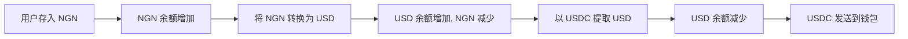

## 概述

Bullring 的多币种架构允许每个子账户同时持有所有支持的法币余额。这种设计使您无需多个账户即可在不同地区无缝运营。

### KYC 要求

<Warning>
  **重要**：用户必须为其打算使用的每种货币完成相应的 KYC/KYB 级别验证。
</Warning>

不同的货币和地区有不同的监管要求。经过 USD 操作验证的子账户可能需要额外验证才能进行 BRL 或 NGN 交易。验证通常按地区或货币系列进行。在没有适当 KYC 状态的情况下尝试使用某种货币进行交易将导致 API 错误。

有关如何验证子账户的详细信息，请参阅[入驻](/zh/use-cases/onboarding)指南。

## 常见使用场景

### 跨境商业运营
- 以本地货币收款（BRL、NGN、MXN）
- 维持多种货币储备
- 在需要时转换为首选货币
- 以收款人的本地货币发送支付

### 加密到法币桥接
- 接收稳定币（USDC/USDT），以 USD 计入
- 将 USD 转换为当地法币
- 向银行账户发送法币支付
- 相关：[加密出金](/zh/use-cases/crypto-offramp)

### 货币风险管理
- 持有多种货币余额以对冲波动
- 在汇率变化前预先转换为目标货币
- 使收入货币与支出货币匹配

### 汇款服务
- 以发送方货币收款
- 以最优汇率转换
- 以收款人当地货币交付
- 相关：[汇款](/zh/use-cases/remittance)

## 多币种工作流程示例

### 端到端流程

### 逐步概念流程

1. **为子账户充值**，以任何支持的货币通过存款。
   - 链接：[存款与入金](/zh/use-cases/fiat-on-ramp)

2. **监控余额**，查看子账户中所有货币的余额。

3. **内部货币转换**，根据您的使用场景按需转换。

4. **发送支付**，以适当的货币发送。
   - 链接：[收款人与支付](/zh/use-cases/beneficiaries)
   - 链接：[收款与支付](/zh/use-cases/collections-and-payouts)

## 相关主题

- [支持的货币](/zh/supported-currencies) - 可用货币和网络的完整列表
- [账户与子账户](/zh/accounts) - 了解账户结构
- [交易前估算](/zh/use-cases/rates-estimates) - 获取汇率和费用
- [存款与入金](/zh/use-cases/fiat-on-ramp) - 为账户充值
- [收款人与支付](/zh/use-cases/beneficiaries) - 提取资金
- [汇款](/zh/use-cases/remittance) - 跨境支付流程
